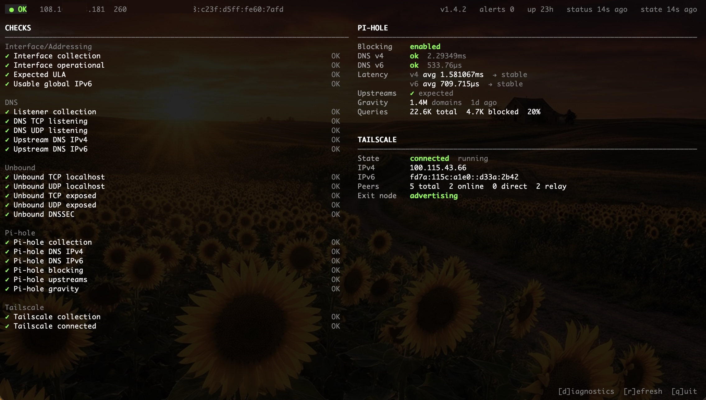

# netmon

A focused Linux network health monitor for a home network appliance. It watches
one interface, runs collectors for DNS health (upstream resolvers, local Unbound,
and Pi-hole), Tailscale connectivity, and listener invariants. It notifies only
when something meaningful changes.

The scope is deliberate. Rather than a general-purpose agent, netmon reconciles a
specific set of invariants that matter for a DNS/VPN appliance and stays quiet
when those invariants hold. Temporary address churn, brief resolver hiccups, and
transient IPv6 state do not generate noise. Only effective health transitions do.

## Dashboard

`netmonctl top` opens a full-screen live dashboard.



The header bar shows overall health, observed public IPs, daemon version, and
uptime. The left column lists all health checks with current severity. The right
column shows Pi-hole state (DNS probes, latency windows with trend arrows,
upstream config, gravity freshness, query counters), and Tailscale state 
(connectivity, peers, and exit-node status). Press `r` to refresh, `q` to quit.

## Design

**Narrow alert model.** The monitor evaluates a fixed set of invariants specific
to this appliance class. It distinguishes CRIT, WARN, and INFO transitions but
notifies only on effective health changes, not on every refresh tick or netlink
event. This keeps mobile notifications short and actionable rather than a stream
of churn.

**Debounced, coalesced scheduler.** Collectors run on independent schedules and
can also be triggered by netlink events. Link/address/route bursts are debounced
over 8 seconds into a single settled refresh. Redundant work is coalesced. If a
refresh is already pending, a new trigger reschedules rather than stacks. This is
backed by [`pending`](https://github.com/kahoon/pending), a purpose-built task
scheduler with full lifecycle telemetry, written alongside this project.

**Clean API boundary.** The daemon exposes all state through a Connect RPC API
over a Unix domain socket and HTTP/2 streaming. The CLI is a thin client with no 
shared memory, no files, no side-channel state. This boundary makes the daemon 
independently introspectable and testable without touching the CLI layer.

**Three-layer observability.** The streaming API is split by audience:

- `watch status`: operator stream, quiet, only emits on effective health changes
- `watch checks`: check-level transitions, which check moved and from what severity
- `watch tasks`: full scheduler telemetry for debugging and development

Keeping these separate avoids mixing operator-facing health state with internal
activity. You can watch the scheduler make decisions in real time through `watch
tasks` without polluting the operator stream.

**Bounded, fixed-size data structures.** DNS latency windows use a ring buffer
from [`ring`](https://github.com/kahoon/ring), a companion package, keeping trend
analysis fixed-size with no steady-state slice growth. Task history for `watch
tasks` replay is backed by the same structure.

**Notification design.** Notifications include only changed non-OK checks.
Recoveries are reported briefly and healthy checks are omitted. The notification
host is resolved through a dedicated fallback resolver rather than the local
system resolver, avoiding the circular failure where a DNS outage also breaks
the ability to send the alert.

## What It Monitors

**Interface & listeners** Operational state, expected IPv6 ULA presence, at
least one usable GUA (tentative and deprecated addresses excluded), and correct
TCP/UDP listener coverage on ports 53 and 5335.

**Upstream DNS** Direct `NS .` probes to pinned root servers, recursive
correctness checks against those same targets, and public IPv4/IPv6 observation
via DNS-based provider chains with deterministic fallback.

**Local DNS stack** DNSSEC validation directly against Unbound on
`127.0.0.1:5335` (one positive and one negative query), Pi-hole DNS probes over
IPv4 and IPv6, upstream configuration match, blocking state, and gravity
freshness.

**Tailscale** Backend state, authentication, and tailnet connectivity. Peer
counts, exit-node status, and advertised routes are collected for operator
visibility.

## Alert Severity

- `CRIT` interface down, ULA missing, port 53 uncovered, Pi-hole DNS failing,
  Pi-hole disabled or misconfigured, Tailscale disconnected
- `WARN` no usable IPv6 GUA, external DNS degraded, DNSSEC validation degraded,
  gravity stale, port 5335 exposed on a non-loopback address
- `INFO` recovery from a previous degraded condition

If both IPv4 DNS probes fail, or both IPv6 DNS probes fail, the monitor reports `CRIT`.

## CLI

`netmonctl` talks to the daemon over the Unix domain socket:

```bash
netmonctl top                           # live dashboard
netmonctl status                        # current health summary
netmonctl watch [status|tasks|checks]   # live streams
netmonctl trace [-scope all|interface|listeners|upstream|unbound|pihole|tailscale]
netmonctl checks [-all]
netmonctl state [-json]
netmonctl stats [-json]
netmonctl info
netmonctl refresh [-scope ...]
netmonctl set debug-logging on|off
netmonctl set runtime-stats-interval 30m
netmonctl help [command]
```

Use `-socket` on any command to override the default socket path
(`/run/netmon/netmond.sock`).

### Observability streams

**`watch status`** is the operator-facing stream. It sends the current health
view immediately on connect, then pushes updates only when effective health
changes. Quiet on a stable system, immediate when something matters.

**`watch checks`** sits one level deeper. It replays recent check transitions
then stays live, showing each check that moved, from what severity to what,
with the current summary and detail.

**`watch tasks`** is the scheduler-facing stream. It exposes the full
[`pending`](https://github.com/kahoon/pending) task lifecycle: scheduled,
rescheduled, executing, executed, cancelled, and failed, with task IDs, delays, and
durations. New subscribers receive a replay of recent history from a bounded
[`ring`](https://github.com/kahoon/ring) buffer before live events continue.
This makes the daemon's internal scheduling decisions inspectable in real time,
not just inferred from logs.

**`trace`** runs a bounded traced refresh and streams the causal path end to end.
Unlike `watch`, it triggers the refresh itself and exits when that work completes.
Useful for answering: which collectors ran, which probes succeeded or failed, how
long each stage took, whether a notification was sent or suppressed.

Example trace output:

```text
[2026-04-17T16:02:11-04:00] trace_started        trace started scope=upstream
[2026-04-17T16:02:11-04:00] collector_started    collector started collector=upstream
[2026-04-17T16:02:11-04:00] probe_result         family=ipv4 latency=12.4ms status=ok target=e.root-servers.net.
[2026-04-17T16:02:11-04:00] probe_result         family=ipv6 latency=15.1ms status=ok target=j.root-servers.net.
[2026-04-17T16:02:11-04:00] collector_finished   collector=upstream duration=58.3ms
[2026-04-17T16:02:11-04:00] notification_skipped reason=no effective changes
[2026-04-17T16:02:11-04:00] trace_completed      duration=59.0ms scope=upstream
```

## Configuration

Required:

- `NTFY_TOPIC` ntfy.sh topic for notifications

Recommended:

- `EXPECTED_ULA` exact static ULA expected on the monitored interface
  (e.g. `fd8f:bd66:6363:1::15`). If unset, the ULA check is skipped.

Optional:

- `MONITOR_IF` interface to monitor (default: `eno1`)
- `NTFY_HOST` notification host (default: `ntfy.sh`)
- `NTFY_RESOLVER` resolver used only for the notification host (default: `9.9.9.9:53`)
- `RPC_SOCKET_PATH` Unix socket path (default: `/run/netmon/netmond.sock`)
- `PIHOLE_PASSWORD` Pi-hole API password for session token
- `DEBUG_EVENTS` log raw netlink events (default: `false`)
- `RUNTIME_STATS_INTERVAL` Go runtime stats interval, `0` to disable (default: `168h`)

## Build & Deploy

```bash
# Build
go build ./cmd/netmond
go build ./cmd/netmonctl

# Cross-compile from macOS
GOOS=linux GOARCH=amd64 go build ./cmd/netmond

# Makefile targets
make fmt
make generate
make test
make build
make build-linux
make VERSION=v0.1.0 build-linux
```

Builds stamp the binary with version, commit, and build time metadata.

**systemd unit:**

```ini
[Unit]
Description=netmon network health monitor
After=network-online.target
Wants=network-online.target

[Service]
Type=simple
User=root
RuntimeDirectory=netmon
EnvironmentFile=/etc/default/netmon
ExecStart=/usr/sbin/netmond
Restart=on-failure
RestartSec=5s

[Install]
WantedBy=multi-user.target
```

**Install:**

```bash
sudo install -m 0755 ./netmond /usr/sbin/netmond
sudo install -m 0755 ./netmonctl /usr/sbin/netmonctl
sudo install -m 0644 ./contrib/netmon.env.example /etc/default/netmon
sudo install -m 0644 ./contrib/netmon.service /etc/systemd/system/netmon.service
sudo systemctl daemon-reload
```

Edit `/etc/default/netmon` for your environment before starting the service, then:

```bash
sudo systemctl enable --now netmon
```

## How It Works

1. Look up the monitored interface and subscribe to netlink link, address, and
   route events.
2. Debounce interface bursts over 8 seconds using
   [`pending`](https://github.com/kahoon/pending).
3. Run collectors on independent schedules: interface (10m), listeners (10m),
   upstream DNS (5m), Unbound (5m), Pi-hole (5m), Tailscale (5m).
4. Evaluate a fixed check set against the latest collected state.
5. Notify only if a check changed or the observed public IP changed.

The daemon is Linux-specific. It reads listener state from procfs, and Tailscale
state via `tailscale status --json` and `tailscale debug prefs`. Protobuf and
Connect stubs are generated with Buf from `proto/netmon/v1/netmon.proto`.
